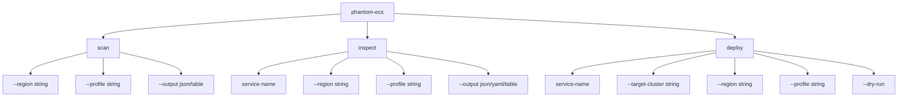
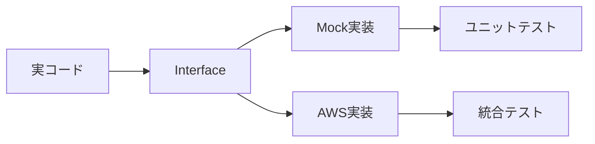
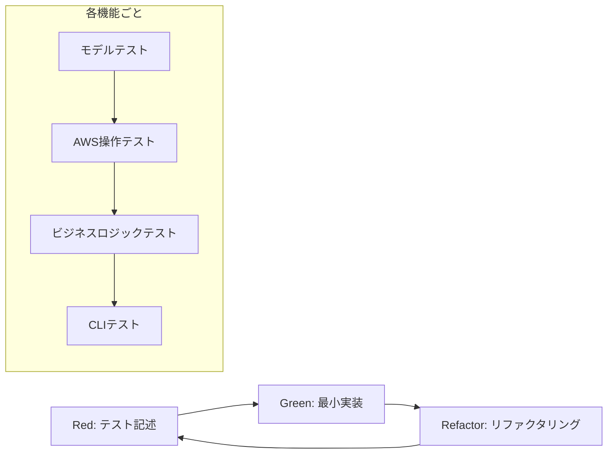

# phantom-ecs TDD設計仕様書

## 📖 概要

AWS ECSサービス調査CLIツール「phantom-ecs」のTDD（テスト駆動開発）アプローチによる設計仕様書です。

### プロジェクト情報
- **プロジェクト名**: github.com/dev-shimada/phantom-ecs
- **言語**: Go 1.24.3
- **開発手法**: TDD（テスト駆動開発）
- **主要ライブラリ**: Cobra CLI、AWS SDK v2

### 主要機能
1. AWS上のECSサービス一覧表示（scan）
2. 特定ECSサービスの詳細調査（inspect）
3. 調査結果に基づく同等サービスの自動作成（deploy）

## 📁 プロジェクト構造設計

```
phantom-ecs/
├── cmd/                          # Cobraコマンド定義
│   ├── root.go                   # ルートコマンド
│   ├── scan.go                   # scanコマンド
│   ├── inspect.go                # inspectコマンド
│   └── deploy.go                 # deployコマンド
├── internal/                     # 内部パッケージ
│   ├── aws/                      # AWS操作関連
│   │   ├── client.go             # AWS クライアント
│   │   ├── ecs.go                # ECS操作
│   │   └── ecs_test.go           # ECSテスト
│   ├── models/                   # データモデル
│   │   ├── service.go            # ECSサービスモデル
│   │   ├── cluster.go            # ECSクラスターモデル
│   │   ├── taskdef.go            # タスク定義モデル
│   │   └── models_test.go        # モデルテスト
│   ├── scanner/                  # スキャン機能
│   │   ├── scanner.go            # サービススキャナー
│   │   └── scanner_test.go       # スキャナーテスト
│   ├── inspector/                # 詳細調査機能
│   │   ├── inspector.go          # サービス詳細調査
│   │   └── inspector_test.go     # インスペクターテスト
│   ├── deployer/                 # デプロイ機能
│   │   ├── deployer.go           # サービスデプロイ
│   │   └── deployer_test.go      # デプロイヤーテスト
│   └── config/                   # 設定管理
│       ├── config.go             # 設定構造体
│       └── config_test.go        # 設定テスト
├── pkg/                          # 公開パッケージ
│   └── phantomecs/               # 公開API
│       ├── client.go             # 公開クライアント
│       └── client_test.go        # クライアントテスト
├── testdata/                     # テストデータ
│   ├── mocks/                    # モックデータ
│   └── fixtures/                 # テストフィクスチャ
├── go.mod
├── go.sum
├── main.go
└── README.md
```

## 🎯 主要コマンド設計（Cobra）

### コマンド構造



### コマンド仕様

#### 1. scanコマンド
```bash
phantom-ecs scan [flags]
```
- **機能**: AWS ECSサービス一覧を表示
- **オプション**:
  - `--region`: AWSリージョン指定
  - `--profile`: AWSプロファイル指定
  - `--output`: 出力形式（json/table）

#### 2. inspectコマンド
```bash
phantom-ecs inspect <service-name> [flags]
```
- **機能**: 指定されたECSサービスの詳細情報を表示
- **引数**: `service-name` - 調査対象のサービス名
- **オプション**:
  - `--region`: AWSリージョン指定
  - `--profile`: AWSプロファイル指定
  - `--output`: 出力形式（json/yaml/table）

#### 3. deployコマンド
```bash
phantom-ecs deploy <service-name> [flags]
```
- **機能**: 指定されたECSサービスと同等のサービスを作成
- **引数**: `service-name` - 複製元のサービス名
- **オプション**:
  - `--target-cluster`: 作成先クラスター名
  - `--region`: AWSリージョン指定
  - `--profile`: AWSプロファイル指定
  - `--dry-run`: 実行せずに処理内容を表示

## 🏗️ パッケージ構成とモジュール分割

### 1. コマンドレイヤー（cmd/）
- **root.go**: グローバル設定、バージョン情報、共通フラグ定義
- **scan.go**: ECSサービス一覧表示コマンド
- **inspect.go**: 特定サービスの詳細調査コマンド
- **deploy.go**: サービス複製・デプロイコマンド

### 2. AWS操作レイヤー（internal/aws/）
- **client.go**: AWS SDK v2クライアント管理、認証設定
- **ecs.go**: ECS API操作（ListServices, DescribeServices, DescribeTaskDefinition等）

### 3. ドメインモデル（internal/models/）
- **service.go**: ECSサービス情報構造体
- **cluster.go**: ECSクラスター情報構造体  
- **taskdef.go**: タスク定義情報構造体

### 4. ビジネスロジックレイヤー
- **scanner/**: ECSサービス検索・一覧化機能
- **inspector/**: サービス詳細情報収集機能
- **deployer/**: サービス複製・作成機能

### 5. 設定管理（internal/config/）
- **config.go**: アプリケーション設定構造体、環境変数・フラグ処理

## 🧪 テスト戦略

### 1. テスト種別

#### ユニットテスト
- 各パッケージの個別機能テスト
- モックを使用したAWS API呼び出しテスト
- ビジネスロジックの単体テスト

#### 統合テスト
- AWS API との実際の連携テスト
- エンドツーエンドのワークフローテスト

#### エンドツーエンドテスト
- CLI コマンド実行テスト
- 実際のAWS環境での動作テスト

### 2. モック戦略



#### インターフェース設計
```go
type ECSClient interface {
    ListServices(ctx context.Context, input *ecs.ListServicesInput) (*ecs.ListServicesOutput, error)
    DescribeServices(ctx context.Context, input *ecs.DescribeServicesInput) (*ecs.DescribeServicesOutput, error)
    DescribeTaskDefinition(ctx context.Context, input *ecs.DescribeTaskDefinitionInput) (*ecs.DescribeTaskDefinitionOutput, error)
    CreateService(ctx context.Context, input *ecs.CreateServiceInput) (*ecs.CreateServiceOutput, error)
    RegisterTaskDefinition(ctx context.Context, input *ecs.RegisterTaskDefinitionInput) (*ecs.RegisterTaskDefinitionOutput, error)
}
```

### 3. テストデータ管理
- **testdata/mocks/**: AWS API レスポンスのJSONモックデータ
- **testdata/fixtures/**: テスト用の設定ファイル、期待値データ

## 📦 依存関係設計

### 主要依存関係

```go
module github.com/dev-shimada/phantom-ecs

go 1.24.3

require (
    github.com/aws/aws-sdk-go-v2 v1.30.0
    github.com/aws/aws-sdk-go-v2/service/ecs v1.44.0
    github.com/aws/aws-sdk-go-v2/config v1.27.0
    github.com/spf13/cobra v1.8.0
    github.com/spf13/viper v1.18.0
    gopkg.in/yaml.v3 v3.0.1
)

require (
    github.com/stretchr/testify v1.9.0
    github.com/golang/mock v1.6.0
) // テスト用
```

### 依存関係の役割
- **AWS SDK v2**: AWS ECS API操作
- **Cobra**: CLI フレームワーク
- **Viper**: 設定管理
- **YAML v3**: YAML出力サポート
- **Testify**: テストアサーション
- **GoMock**: モック生成

## 🚀 TDD開発進行順序

### Phase 1: 基盤構築（高優先度）

#### 1. AWS クライアント設定
- `internal/aws/client.go` + `client_test.go`
- AWS認証・リージョン設定
- 基本的なクライアント初期化

#### 2. 基本データモデル
- `internal/models/` パッケージ全体
- ECS関連構造体定義
- JSON/YAMLタグ設定

#### 3. 設定管理
- `internal/config/config.go` + `config_test.go`
- CLI引数・環境変数処理
- バリデーション機能

### Phase 2: コア機能実装（中優先度）

#### 4. Scanner機能
- `internal/scanner/scanner.go` + `scanner_test.go`
- ECSサービス一覧取得
- フィルタリング機能

#### 5. Inspector機能
- `internal/inspector/inspector.go` + `inspector_test.go`
- サービス詳細情報収集
- タスク定義情報取得

#### 6. Basic Deployer
- `internal/deployer/deployer.go` + `deployer_test.go`
- サービス複製基本機能
- タスク定義複製

### Phase 3: CLI統合（中優先度）

#### 7. Cobraコマンド実装
- `cmd/` パッケージ各コマンド
- CLI引数解析・バリデーション
- エラーハンドリング

#### 8. 出力フォーマット
- JSON/YAML/Table形式サポート
- プリティプリント機能

### Phase 4: 高度機能（低優先度）

#### 9. クラスター選択機能
- 既存/新規クラスター選択
- クラスター作成機能
- クラスター共通化オプション

#### 10. エラーハンドリング強化
- AWS API エラー処理
- リトライ機能
- ユーザーフレンドリーなエラーメッセージ

## 🎨 TDD開発サイクル

### 開発サイクル


### 具体的なTDDステップ例

#### 例: Scanner機能の開発
1. **Red**: Scanner のテストを書く（失敗）
2. **Green**: 最小限のScanner実装（成功）
3. **Refactor**: コードを改善、インターフェース整理
4. **Red**: より複雑なシナリオのテスト追加
5. **Green**: 機能拡張
6. **Refactor**: さらなる改善

## 📋 開発チェックリスト

### Phase 1 完了条件
- [ ] AWS SDK v2 クライアント設定完了
- [ ] ECS基本データモデル定義完了
- [ ] 設定管理機能実装完了
- [ ] 各機能のユニットテスト作成完了
- [ ] モックインターフェース定義完了

### Phase 2 完了条件  
- [ ] ECSサービス一覧取得機能完了
- [ ] ECSサービス詳細調査機能完了
- [ ] 基本的なサービス複製機能完了
- [ ] 統合テスト作成完了
- [ ] エラーハンドリング基本機能完了

### Phase 3 完了条件
- [ ] 全CLIコマンド実装完了
- [ ] 複数出力フォーマット対応完了
- [ ] エンドツーエンドテスト完了
- [ ] ドキュメント作成完了

### Phase 4 完了条件
- [ ] クラスター選択機能完了
- [ ] 高度なエラーハンドリング完了
- [ ] パフォーマンス最適化完了
- [ ] 運用ドキュメント完成

## 🔧 実装ガイドライン

### コーディング規約
- Go の標準的なコーディング規約に従う
- `gofmt`, `go vet`, `golint` を使用
- インターフェースベースの設計
- エラーハンドリングの徹底

### テスト規約
- テストファイルは `*_test.go`
- テスト関数は `Test*` で開始
- モックは `testdata/mocks/` に配置
- カバレッジ80%以上を目標

### Git ワークフロー
- feature ブランチでの開発
- プルリクエストでのコードレビュー
- CI/CD パイプラインでの自動テスト

## 📖 次のステップ

この設計仕様書に基づいて、TDD開発を開始してください。

1. Phase 1から順次実装開始
2. 各機能ごとにテストファースト開発
3. 継続的なリファクタリング
4. 定期的な設計レビューと調整

---

**設計書作成日**: 2025年6月17日  
**対象プロジェクト**: github.com/dev-shimada/phantom-ecs  
**開発手法**: TDD（テスト駆動開発）
